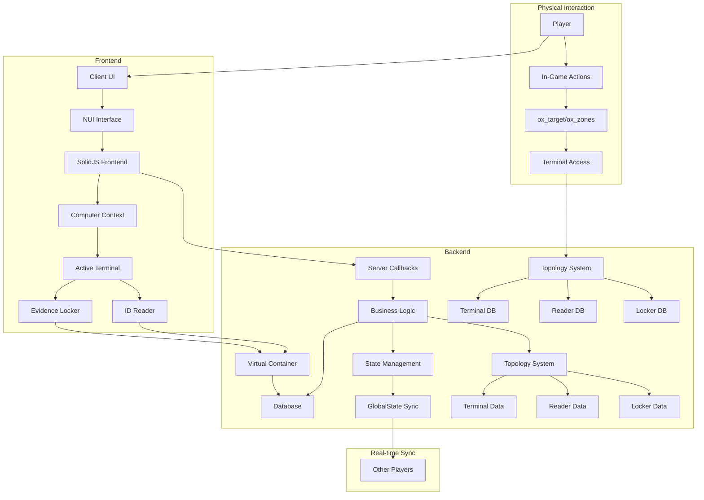
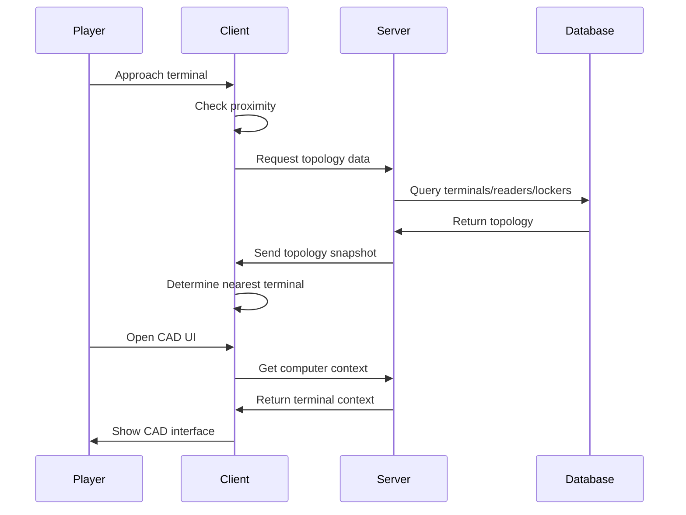
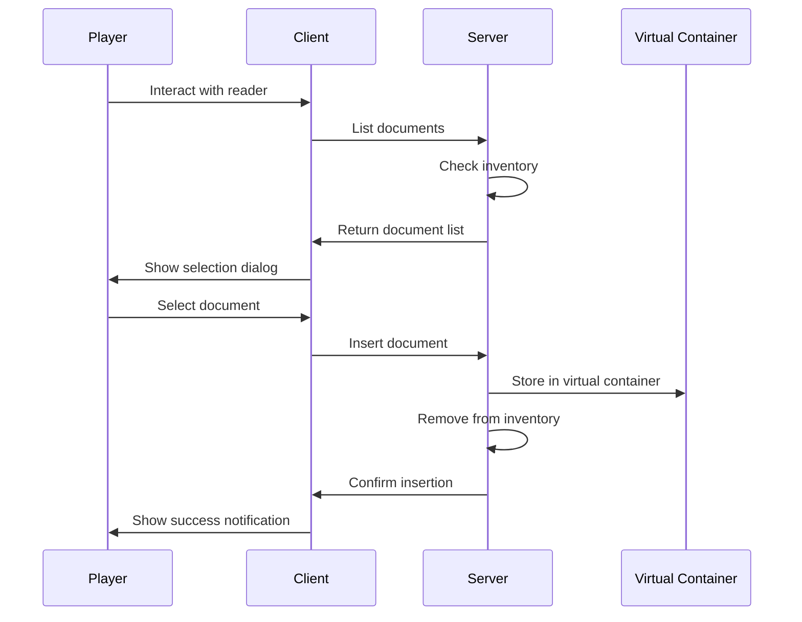
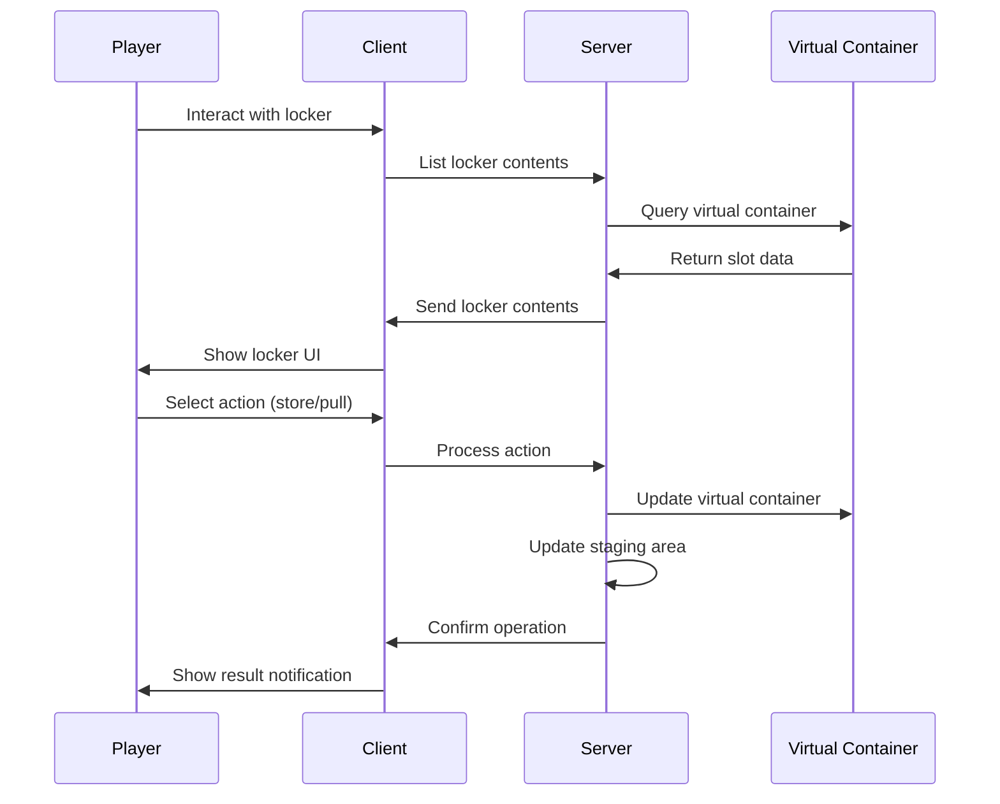
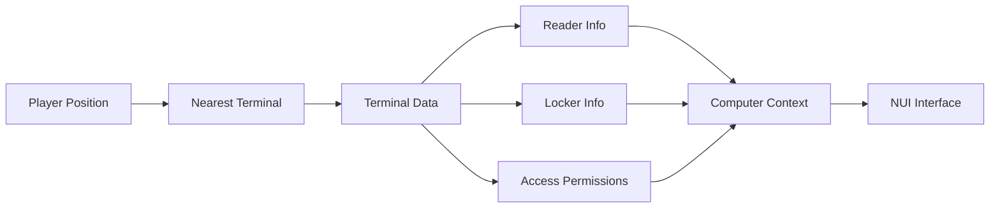
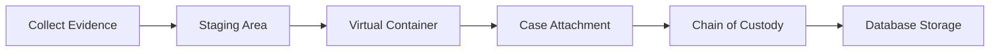
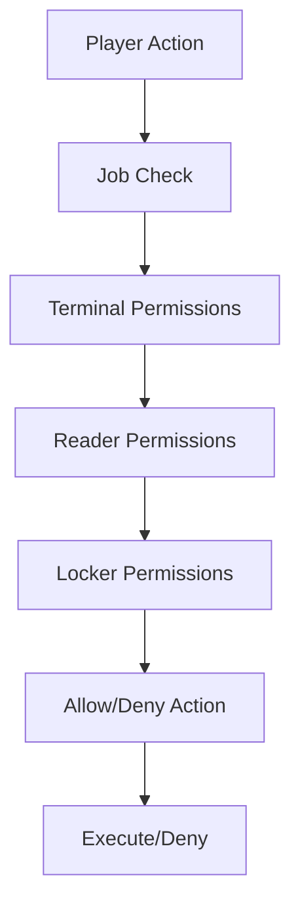

# CAD System Architecture

## Overview

The CAD (Computer Aided Dispatch) system is a comprehensive law enforcement and emergency services management tool for FiveM roleplay servers. It provides integrated dispatch, case management, forensics, and EMS services.

## Component Interaction Diagram

## Key Workflows

### 1. Terminal Access Workflow

### 2. ID Reader Workflow

### 3. Evidence Locker Workflow

## Data Flow Architecture

### Terminal Context Flow

### Evidence Flow

## Security Architecture

### Access Control Flow

## System Components

### 1. Database Layer
- MySQL storage for persistent data
- Automatic schema management
- Regular cleanup events
- StateBag synchronization

### 2. Server Logic
- Topology management
- Virtual container system
- Evidence processing
- Dispatch operations
- Case management

### 3. Client Interface
- NUI with SolidJS frontend
- Terminal interaction zones
- Real-time state updates
- Notification system

### 4. Integration Points
- QBCore framework
- ox_lib utilities
- ox_inventory system
- ox_target zones

This architecture provides a robust, scalable system for law enforcement roleplay with comprehensive evidence handling and real-time coordination capabilities.
